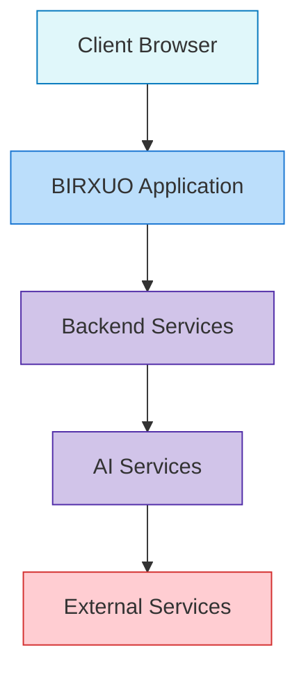

# BIRXUO AI ON

<div align="center">
  
  <h3>Unlock the Power of AI – Seamlessly.</h3>
</div>

BIRXUO is a cutting-edge web application that brings advanced AI capabilities to your fingertips. Built with modern web technologies, it offers an intuitive interface designed for scalability and high performance.


---

## 📑 Table of Contents

- [Overview](#overview)
- [Features](#features)
- [System Architecture](#system-architecture)
- [Data Flow](#data-flow)
- [Technologies](#technologies)
- [Getting Started](#getting-started)
  - [Installation](#installation)
  - [Development Server](#development-server)
  - [Production Build](#production-build)
- [Usage](#usage)
- [Performance Metrics](#performance-metrics)
- [Contributing](#contributing)
- [License](#license)
- [Contact](#contact)

---

## 🔍 Overview

BIRXUO is designed to empower users by integrating robust AI functionalities within a user-friendly web interface. Whether you are looking to automate tasks, perform data analysis, or generate dynamic content, BIRXUO AI ON provides the tools to do it all.

<div align="center">
  
  <p><em>The BIRXUO dashboard brings AI capabilities to your fingertips</em></p>
</div>

---

## ✨ Features

| Feature | Description |
|---------|-------------|
| **AI-Driven Insights** | Leverage state-of-the-art machine learning models for data processing and predictive analytics |
| **Interactive Dashboards** | Visualize complex data through intuitive, customizable dashboards |
| **Workflow Automation** | Create, test, and deploy automated workflows with trigger conditions and actions |
| **Multi-format Data Processing** | Support for CSV, JSON, XML, and custom data formats |
| **Advanced Analytics** | Statistical analysis, machine learning processing, time series analysis, and NLP capabilities |
| **Seamless Integration** | Connect with third-party services and OAuth providers |
| **Responsive Design** | Enjoy a modern UI that works across all devices |

---

## 🏗️ System Architecture

BIRXUO follows a modern, layered architecture designed for scalability and maintainability.



### Component Breakdown

Our system is divided into four primary layers:

1. **Frontend Layer**
   - UI Components
   - State Management
   - Routing
   - Custom Hooks
   - Authentication UI

2. **Core Services**
   - API Services
   - AI Engine
   - Data Processing
   - Workflow Engine
   - Auth Service

3. **Backend Layer**
   - RESTful API
   - MongoDB Storage
   - ML Models
   - Task Queue

4. **External Integrations**
   - Third-Party APIs
   - OAuth Providers

---

## 🔄 Data Flow

BIRXUO processes data through a sophisticated pipeline designed for maximum efficiency:

<div align="center">
  
  <p><em>Data flow from input to analysis and visualization</em></p>
</div>

1. **Input Stage**
   - Raw data input with format detection
   - Format-specific parsing (CSV, JSON, XML, etc.)

2. **Preprocessing Stage**
   - Data cleaning
   - Normalization
   - Feature extraction
   - Data transformation

3. **Analysis Stage**
   - Multiple analysis types:
     - Statistical analysis
     - Machine learning processing
     - Time series analysis
     - NLP processing
   - Results aggregation

4. **Visualization & Workflow**
   - Dashboard visualization
   - Optional workflow creation
   - Trigger definition
   - Action configuration
   - Testing and deployment

---

## 💻 Technologies

BIRXUO leverages a modern tech stack to deliver powerful AI capabilities:

### Frontend
- **React.js + TypeScript**: Building robust, type-safe UI components
- **Tailwind CSS**: For responsive and customizable styling
- **TensorFlow.js**: Client-side machine learning capabilities

### Backend
- **Node.js**: High-performance server runtime
- **Express**: Fast, unopinionated web framework
- **MongoDB**: Flexible document database
- **JWT Authentication**: Secure user authentication

### AI & Data Processing
- **Machine Learning Models**: For predictive analytics
- **Data Processing Pipelines**: For ETL operations
- **NLP Libraries**: For text analysis and processing

### Deployment & DevOps
- **Docker**: Containerization for consistent environments
- **GitHub Actions**: CI/CD automation
- **Vite**: Fast build tooling and development server

<div align="center">
  
  <p><em>Visual representation of the BIRXUO technology stack</em></p>
</div>

---

## 🚀 Getting Started

### Installation

1. **Clone the repository:**

   ```bash
   git clone https://github.com/Birxuo/Birxuo.git
   cd Birxuo
   ```

2. **Install dependencies:**

   ```bash
   npm install
   ```

### Development Server

To start the development server, run:

```bash
npm run dev
```

Open your browser and navigate to [http://localhost:3000](http://localhost:3000) (or the port indicated in your terminal) to view the application.

### Production Build

To create an optimized production build, run:

```bash
npm run build
```

Then, preview the build with:

```bash
npm run preview
```

---

## 📊 Performance Metrics

BIRXUO is designed for performance across various operations:

| Operation | Average Response Time | Throughput |
|-----------|----------------------|------------|
| Data Upload (1MB) | < 0.5s | 100 req/min |
| AI Analysis (Basic) | 1-2s | 60 req/min |
| ML Model Training | 5-30s* | 10 req/min |
| Dashboard Rendering | < 1s | 200 req/min |
| Workflow Execution | < 3s | 40 req/min |

*Depends on model complexity and data size

### System Requirements

| Environment | Minimum | Recommended |
|-------------|---------|-------------|
| CPU | 2 cores | 4+ cores |
| RAM | 4GB | 8GB+ |
| Storage | 500MB | 2GB+ |
| Network | 5 Mbps | 20+ Mbps |
| Browser | Chrome 90+, Firefox 88+, Safari 14+ | Latest versions |

---

## 🧪 Usage

Once the development server is running, explore the intuitive user interface to interact with the AI functionalities:

### Basic Workflow

1. **Upload Data**: Import your data in CSV, JSON, or XML format
2. **Process & Analyze**: Select analysis types and preprocessing steps
3. **Visualize Results**: Explore insights through interactive dashboards
4. **Create Workflows** (Optional): Automate repeating processes

<div align="center">
  
  <p><em>Example workflow from data upload to visualization</em></p>
</div>

Detailed documentation on usage and customization is available in the [docs](./docs) folder.

---

## 👥 Contributing

Contributions are welcome! If you have ideas, feature requests, or bug fixes, please follow these steps:

1. Fork the repository
2. Create your feature branch: `git checkout -b feature/my-feature`
3. Commit your changes: `git commit -m 'Add my feature'`
4. Push to the branch: `git push origin feature/my-feature`
5. Open a pull request

<div align="center">
  
  <p><em>Visualization of the contribution workflow</em></p>
</div>

For more detailed guidelines, please refer to the [CONTRIBUTING.md](./CONTRIBUTING.md) file.

---

## 📝 License

This project is licensed under the [Apache-2.0 License](./LICENSE).

---

## 📞 Contact

For further information or support, please open an issue on [GitHub](https://github.com/Birxuo/Birxuo/issues) or contact the project maintainers.

<div align="center">
  <a href="https://github.com/Birxuo/Birxuo/issues">Report Bug</a> •
  <a href="https://github.com/Birxuo/Birxuo/issues">Request Feature</a>
</div>

